# RaG Economy Manager

RaG Economy Manager is a Windows beta tool for DayZ server owners who need to inspect, edit, validate, and explain mission economy files without hand-editing every XML file blind.

Current version: `0.70 Beta`

License: Freeware - Proprietary / All Rights Reserved

## Beta Warning

Use copied mission files first. The app is source-aware, creates rolling backups before overwrites, and asks before saving, but it still edits real files. Do not point early beta builds at a live production server folder unless you already have backups.

## Licence

RaG Economy Manager is freeware with proprietary source code. Personal and authorized DayZ server management use is permitted free of charge. Selling, redistributing, modifying, decompiling, reverse engineering, publishing, or including the software or source in another project requires written permission from the author.

See `LICENSE.txt` for full terms. Third-party asset licences remain covered by `THIRD_PARTY_NOTICES.txt`.

## What It Manages

- Types: `types.xml` and split type files referenced from `cfgeconomycore.xml`
- Spawnabletypes: `cfgspawnabletypes.xml`
- Randompresets: `cfgrandompresets.xml`
- Definitions: `cfglimitsdefinition.xml`
- Economy Core: `cfgeconomycore.xml`
- Events: `events.xml`, `cfgeventspawns.xml`, `cfgenvironment.xml`, and linked territory files
- Territories: env `*_territories.xml` files with map editing
- CE Zones: DayZ CE Tool usage flags, value tiers, water, key points, and paint layers
- Mapgroupproto: `mapgroupproto.xml` loot prototype groups, containers, filters, and points
- Weather: `cfgweather.xml`
- Configs: supported mission XML, JSON, C, and CFG files
- Profiles: optional server profiles folder configs outside the mission folder
- Logs Analyzer: RPT, ADM, script logs, crash logs, console logs, TXT, and minidumps

### Dashboard

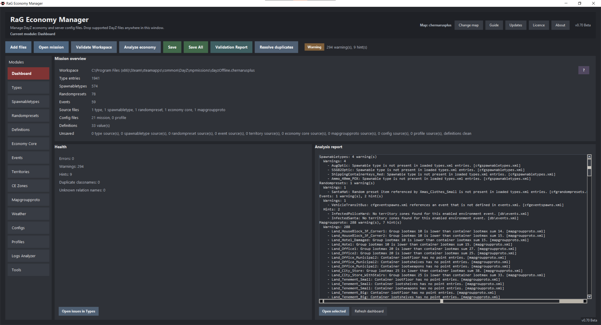

### Types

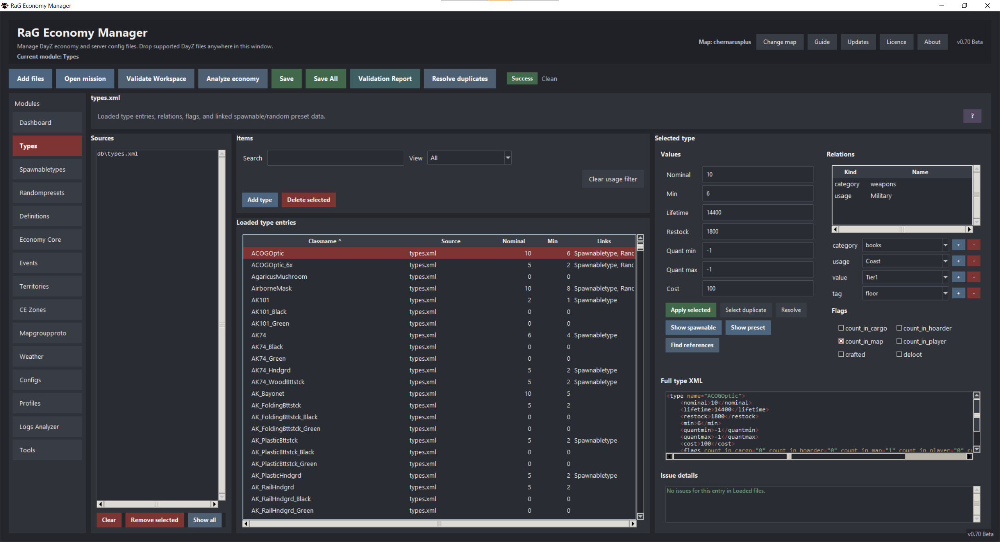

### Spawnabletypes

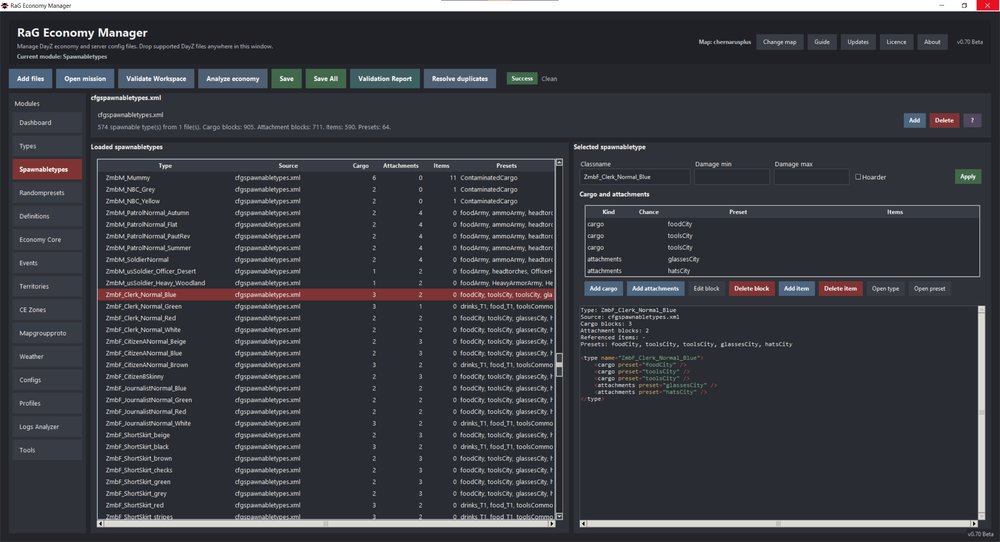

### Randompresets

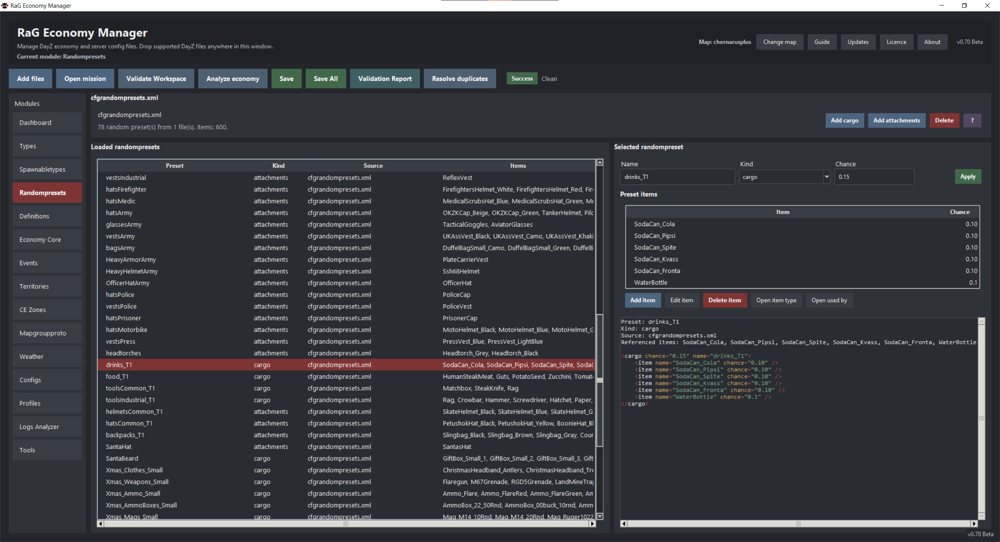

### Definitions

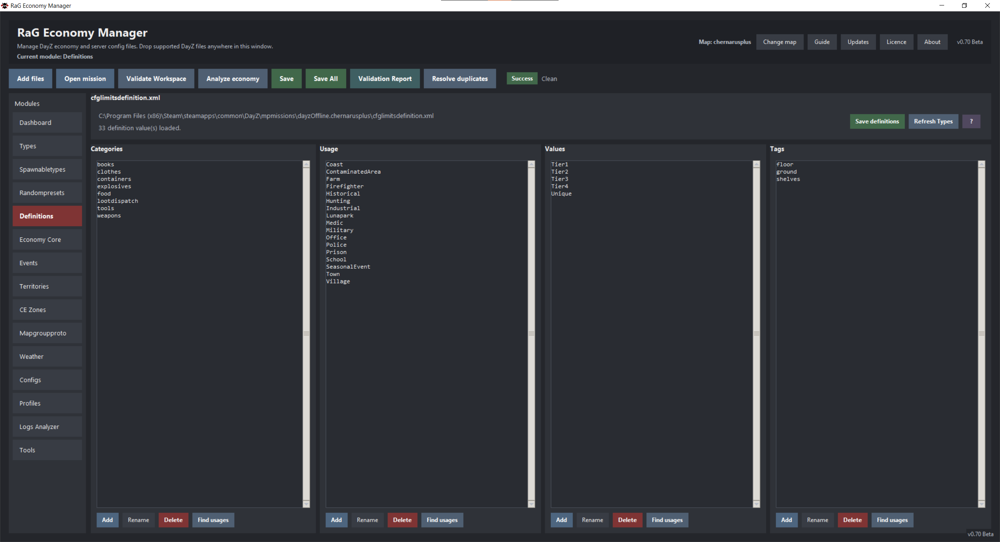

### Economy Core

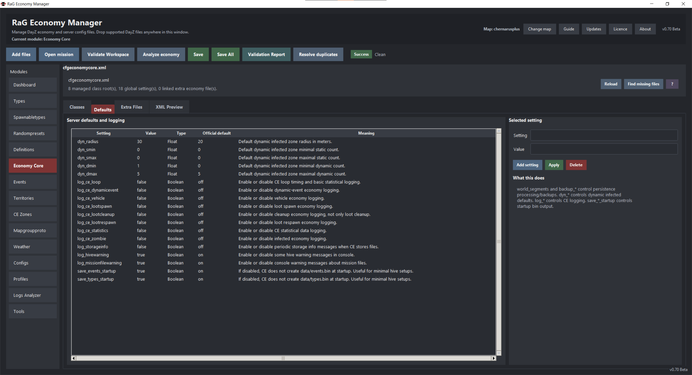

### Events

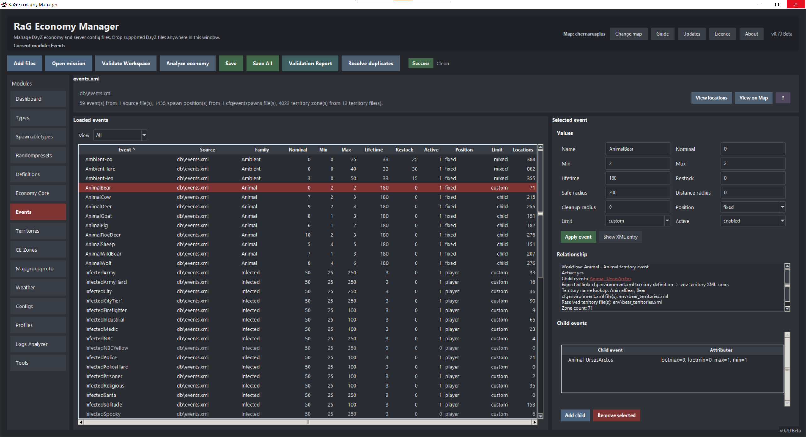

### Territories

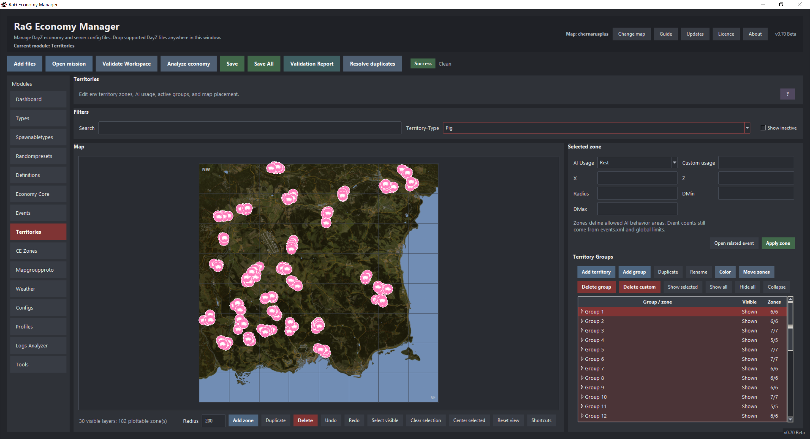

### CE Zones

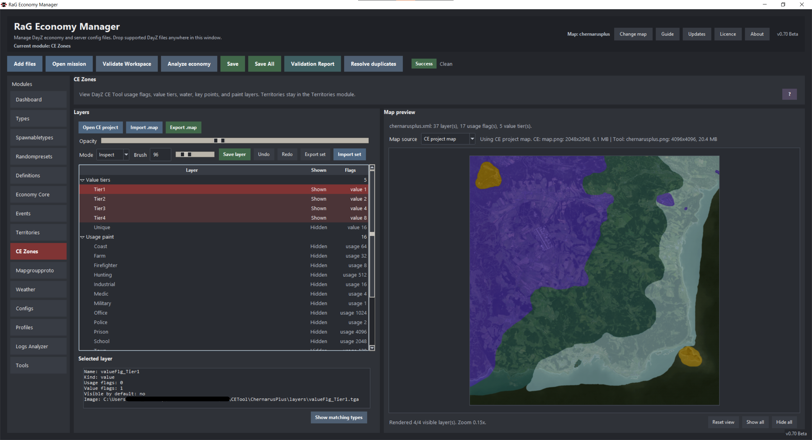

### Mapgroupproto

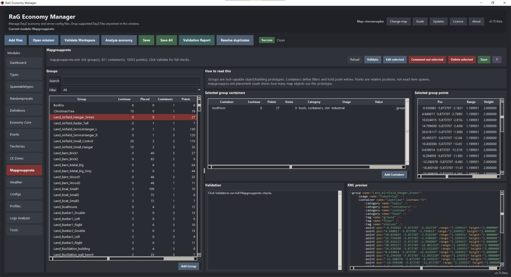

### Weather

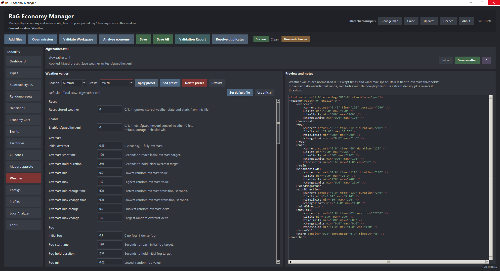

### Configs

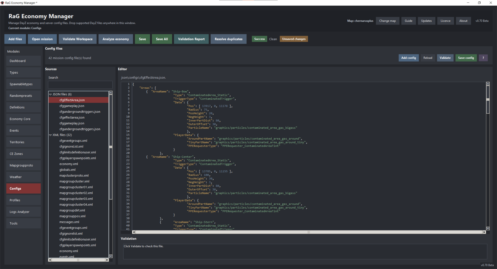

### Profiles

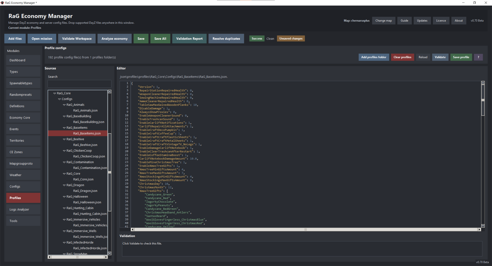

### Logs Analyzer

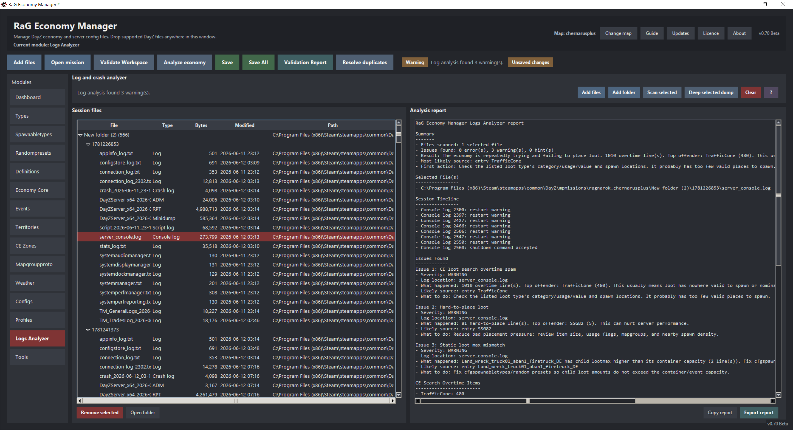

### Tools

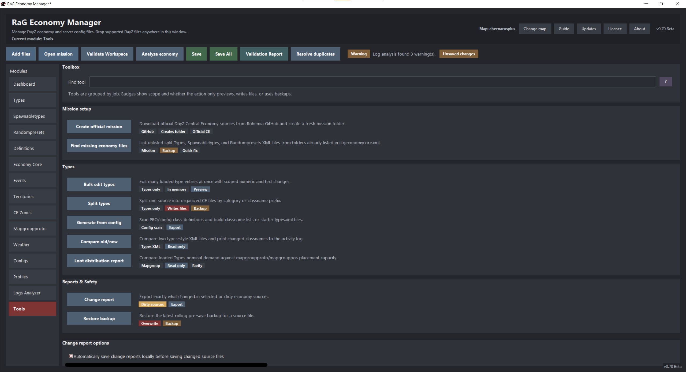

## Getting Started

The app shows a built-in Getting Started guide on startup unless `Don't show again` is checked. Use the `Guide` button in the top bar to reopen it.

Use `Updates` in the top bar to check public GitHub Releases. Newer release installers are downloaded only when GitHub supplies a matching SHA-256 digest or checksum asset. Unsaved mission changes block installer launch.

Basic workflow:

1. Open a copied DayZ mission folder with `Open mission`, or create a fresh official mission from `Tools`.
2. Choose the detected map or import/download a map image.
3. Use `Validate Workspace` when you want syntax and reference checks.
4. Use the Dashboard Analysis Report to jump to issues.
5. Edit the relevant module.
6. Use `Save` for the selected source or `Save All` for every dirty source.
7. Export `Validation Report` before sharing files with testers.

## Key Features

- Mission loading for `db/types.xml` plus active `cfgeconomycore.xml` CE folders
- Commented-out `cfgeconomycore.xml` entries ignored
- XML syntax errors reported with line/column context without blocking the file from loading
- Source-aware editing and dirty markers
- Save selected source or Save All dirty sources
- Rolling pre-save backups and backup restore tool
- Manual change reports plus optional local autosave of reports
- Mission-wide validation report as TXT and JSON
- Dashboard issue list with navigation into relevant modules
- Duplicate classname detection and resolver
- Types relation editing for `category`, `tag`, `usage`, and `value`
- Types flags editing for `count_in_cargo`, `count_in_hoarder`, `count_in_map`, `count_in_player`, `crafted`, and `deloot`
- Spawnabletypes editor with cargo/attachments blocks, damage ranges, and randompreset dropdowns
- Randompresets editor with cargo/attachments presets and item chance editing
- Economy Core editor for CE managed classes, server defaults, and extra economy files
- Type reference actions for Spawnabletypes and Randompresets
- Events editor with child events, active/position/limit dropdowns, relationship analysis, and map plotting
- Territories map editor with grouped layers, box selection, Ctrl multi-select, Alt pan, move, resize, add, duplicate, delete, undo, and redo
- CE Zones viewer for official CE Tool project XML, usage paint layers, value tier layers, water/key point overlays, and matching Types filtering
- Mapgroupproto viewer/editor for loot prototype groups, container filters, relative spawn points, placement counts, matching item candidates, search/filter, exact issue jumps, add group/container actions, and comment/delete cleanup
- Weather editor with official defaults, custom default file, seasonal presets, and custom presets
- Config and Profiles editors with syntax highlighting and line numbers
- Logs Analyzer with readable summaries for DayZ server/session files and optional deep minidump scan through Windows Debugging Tools
- Type splitter with copy/move modes, preview, backups, and optional `cfgeconomycore.xml` activation
- Loot distribution / rarity report estimating per-item findability from Types, mapgroups, events, spawnabletypes, randompresets, flags, and hoarding sensitivity
- Generated type skeletons from PBOs/source configs when `CfgConvert.exe` is configured
- Official mission creator for fresh Bohemia CE templates
- Windows installer build through PyInstaller `onedir` plus Inno Setup
- Manual GitHub Releases update check with SHA-256 installer verification

## Current Validation Rules

The validator tries to avoid noisy false positives. Some DayZ entries are valid even when they look incomplete.

Types:

- Missing `lifetime` and missing/incomplete `flags` matter.
- Missing `nominal`, `restock`, `min`, or `category` is not automatically an error.
- `nominal=0` alone is not a hint.
- `nominal=0` with `min>0` is a warning except for known special cases.
- Vanilla infected names starting with `ZmbM` or `ZmbF` are treated as special cases.
- `Animal*` entries are treated as special cases.
- Entries with `nominal=0` and `min=0` can be valid non-spawning support entries.
- Missing category, usage, and value tier are available as filters instead of noisy hints.
- `crafted=1` only warns when `nominal` or `min` is above 0.
- `deloot=1` and count flags are available as filters instead of global hints.

Events:

- Disabled events are skipped by relationship validation.
- Vehicle/fixed events commonly use `cfgeventspawns.xml`.
- Animal and infected workflows often resolve through `cfgenvironment.xml` and env territory XML.
- Missing infected territory zones are usually hints, because static situations can legitimately use them.
- Animal/Ambient missing mappings are more likely warnings.

Weather:

- Values are checked for valid ranges, min/max consistency, negative times, and broken storm/rain/snow threshold combinations.
- Weather save blocks hard validation errors.

Configs and Profiles:

- JSON and XML syntax is validated directly.
- C/CFG files are syntax-highlighted but not fully compiled or interpreted.

Economy Core:

- CE Managed Classes are not the loot table. `types.xml` is still the loot table.
- CE Managed Classes tell Central Economy which config inheritance roots it should scan, classify, spawn, persist, clean up, or count.
- Vanilla roots such as `DefaultWeapon`, `DefaultMagazine`, `Inventory_Base`, `HouseNoDestruct`, `SurvivorBase`, `DZ_LightAI`, `CarScript`, and `BoatScript` cover most normal items, characters, AI, statics, cars, and boats.
- `act="character"` is for players, infected, animals, or AI roots. `act="car"` is for movable vehicles and boats.
- Do not add every mod item class as a root. Add a class only when a mod introduces a new base/root inheritance family not covered by vanilla roots.
- Server Defaults expose `world_segments`, persistence backup settings, dynamic infected fallbacks, CE logging, and startup output toggles.
- Extra Economy Files register split `types`, `spawnabletypes`, and `randompresets` XML files from folders already listed as `<ce folder="...">`.
- `Find missing files` only scans folders already registered in `cfgeconomycore.xml`; it does not crawl unrelated mission folders.

## Saving And Backups

`Save` writes the selected source file. `Save All` writes every dirty source separately.

The app does not merge all files into one output. If your mission uses split type files, each dirty source remains separate.

Module-owned files are saved from their module, not from the generic Configs editor. For example, `db\types.xml`, `db\events.xml`, `db\cfgspawnabletypes.xml`, `db\cfgrandompresets.xml`, `cfgeconomycore.xml`, definition files, weather files, and territory files should be edited and saved through their dedicated category. This prevents the raw Configs editor from accidentally overwriting structured economy files.

Before overwriting a file, the app checks whether the target can be written. If a mission lives inside Steam or `Program Files`, Windows may block writes to files under `db\`. In that case, copy the mission to a writable work folder, remove read-only flags, close any running server/editor that has the file locked, or run the app with higher permissions if you intentionally work inside the protected folder.

Rolling backups are stored locally under:

```text
%APPDATA%\RaG Economy Manager\backups
```

Change reports are stored locally when manually exported or when optional autosave is enabled:

```text
%APPDATA%\RaG Economy Manager\change_reports
```

## Official Mission Creator

The Tools module can create a clean mission from the official Bohemia Interactive Central Economy sources:

```text
Tools -> Mission setup -> Create official mission
```

Supported templates:

```text
dayzOffline.chernarusplus
dayzOffline.enoch
dayzOffline.sakhal
```

The creator downloads and caches the official repository ZIP from:

```text
https://github.com/BohemiaInteractive/DayZ-Central-Economy
```

Cache location:

```text
%APPDATA%\RaG Economy Manager\official_ce
```

`Update sources` refreshes the cached official files. The creator refuses to write into a non-empty output folder. After creation, the app can open the new mission immediately.

Important license note: the official CE data is Bohemia Interactive content under ADPL-SA terms. Use it only for DayZ/Arma-compatible, non-commercial work and keep share-alike obligations in mind when distributing derived files.

## Map Assets

Map images are not shipped in the main app repository. The app uses a local cache:

```text
%APPDATA%\RaG Economy Manager\maps
```

Default map assets are resolved from the public GitHub repository:

```text
Tyson89/RaG-Economy-Maps
```

Supported repository layout:

```text
maps/chernarusplus.png
maps/livonia.png
maps/sakhal.png
```

Users can also import a local custom map image from the `Change map` dialog. Imported maps are copied into local app data, not linked to the original file path.

## CE Zones

CE Zones reads DayZ CE Tool project XML files such as:

```text
CETool\ChernarusPlus\chernarusplus.xml
```

The viewer expects matching layer masks in a `layers` folder next to the project XML:

```text
CETool\ChernarusPlus\layers\valueFlg_Tier1.tga
CETool\ChernarusPlus\layers\usgFlg_Paint-Military.tga
```

The module can:

- Render CE Tool `.tga` layer masks over the map
- Toggle value tiers, usage paint layers, usage defaults, water, and key point layers
- Adjust overlay opacity with true alpha blending
- Paint or erase editable usage/value layers with a brush
- Save edited `.tga` layer masks with rolling backups and a local change report
- Export/import CE Zone layer sets for custom maps
- Import/export exported `areaflags.map` files for editing existing CE area maps
- Inspect map positions and report which visible layers cover that point
- Filter Types by selected usage or value layer with `Show matching types`

`areaflags.map` support is based on the DayZ CE Editor binary layout observed from exported Chernarus files: a 24-byte header followed by four usage flag planes and one value flag plane. Export preserves unmapped bits from the imported map and overwrites only layer flags represented by the open CE project. Value tier import is verified against CE Tool TGA masks; usage paint/default layers can differ from the compiled map, so test on copied projects first.

## Mapgroupproto

The Mapgroupproto module opens the mission-root `mapgroupproto.xml` as its own DayZ-aware workspace instead of showing it as a generic Configs file. It also handles directly added `mapgroupproto.xml` files and can recover the mission-root file when the loaded Types source comes from `db\`.

`mapgroupproto.xml` describes loot spawn prototypes for buildings and objects. It defines prototype groups, containers, filters, and relative loot points. It does not directly set item quantities, and it does not force a specific normal item classname to spawn.

The module cross-checks the prototype file against:

```text
types.xml and split type files from cfgeconomycore.xml
cfglimitsdefinition.xml
mapgrouppos.xml
```

It reports duplicate groups, invalid or unknown relation names, containers that match no loaded type entries, groups without containers, containers without points, bad point coordinates/range/height values, lootmax mismatches, prototypes not placed on the map, and placed `mapgrouppos.xml` objects without a matching prototype.

The module keeps the full XML source internally and shows a read-only selected-group XML preview for inspection. Users can search groups, filter for missing category/usage/value/tag filters or zero matching items, click validation issues to jump to exact groups, add groups, add containers, edit selected groups/containers/points, and comment out selected groups, containers, or points without rerunning full validation.

The current guided editor covers group, container, relation filter, and point fields. Container names include common DayZ choices such as `lootWeapons`, `lootClothes`, `lootContainers`, `lootFloor`, and `lootTools`. Advanced dispatch/proxy editing, group duplication, and point add/delete workflows are still planned.

## Loot Distribution / Rarity

The Tools module includes a read-only Loot Distribution / Rarity report. It estimates configured item findability from loaded Types sources and the mission files that describe where loot can actually appear:

```text
mapgroupproto.xml
mapgrouppos.xml
events.xml
cfgeventspawns.xml
cfgspawnabletypes.xml
cfgrandompresets.xml
```

The report uses mission `db\types.xml` plus split CE files referenced by `cfgeconomycore.xml`. It does not rate rarity from `nominal` alone. It combines item economy values, category/usage/value/tag relations, mapgroup loot positions, placed object counts, event child loot, cargo/attachment sources, and hoarding flags.

Each item row includes nominal/min/lifetime/restock/cost, relations, flags, eligible spawn points, location density, hoarding sensitivity, effective rarity score, findability score, rarity index, estimated rarity label, spawn sources, and usage/tier distribution. The result can be exported as CSV or JSON.

This is not a full CE simulator. It is an estimated configured rarity/distribution report. It cannot know the exact live server state because actual spawns depend on persistence, player inventories, hoarding, cleanup, restock timing, dynamic events, and current CE state.

## Logs And Minidumps

Logs Analyzer is intended for server hosters, not engine developers. It tries to explain likely causes in plain language and point to useful mod/file/function/line evidence.

Deep minidump analysis requires Windows Debugging Tools. Native crash detail is limited because Bohemia private DayZ symbols are not public.

## Quick Fixes

Some missing base files can be created from the app when a module needs them. For example, missing `db\cfgspawnabletypes.xml` or `db\cfgrandompresets.xml` can be created after user confirmation. If the prompt is cancelled, no empty placeholder file is written.

Tools can also scan mission subfolders for split `types`, `spawnabletypes`, and `randompresets` XML files that are not registered in `cfgeconomycore.xml`. The app opens a selection window so users can choose which registrations to create or ignore, creates a backup when overwriting an existing `cfgeconomycore.xml`, then reloads the mission.

## Known Limitations

- This is beta software. Test on copied mission files.
- Validation cannot prove every DayZ Central Economy behavior.
- C/CFG profile/config files are highlighted, not fully parsed like the DayZ engine.
- Minidump analysis is limited without private DayZ symbols.
- Map plotting depends on available map images and correct world size metadata.
- CE Zones edits CE Tool XML/TGA layer masks and can import/export `areaflags.map`; test exports on copied CE projects first.
- Mapgroupproto guided editing covers add group, add container, existing groups, containers, filters, points, comment-out for selected group/container/point, and group delete. Dispatch/proxy editing, group duplication, and point add/delete workflows are still future work.
- Official mission creation depends on GitHub access when the official CE cache is missing or when `Update sources` is used.
- Undo/redo is strongest in the Territories map editor; not every module has full undo history yet.

## Near-Term Roadmap

- More complete quick fixes for missing CE registrations and missing relation definitions
- Better relationship graph across Types, Spawnabletypes, Randompresets, Events, Territories, and configs
- CE Zones polish for `areaflags.map` conflict reporting and broader test coverage with more maps
- Loot distribution and rarity balancing tools
- Advanced Mapgroupproto editing for group duplication, point add/delete workflows, and dispatch/proxy blocks
- Workspace project save/restore for recent missions, selected map, filters, active module, and layout state
- Stronger DayZ-aware editors for `globals.xml`, `economy.xml`, `cfgeventspawns.xml`, and `cfgplayerspawnpoints.xml`
- Wider undo/redo coverage
- Optional remote/SFTP workflow with dry-run diff, backups, and rollback guidance
